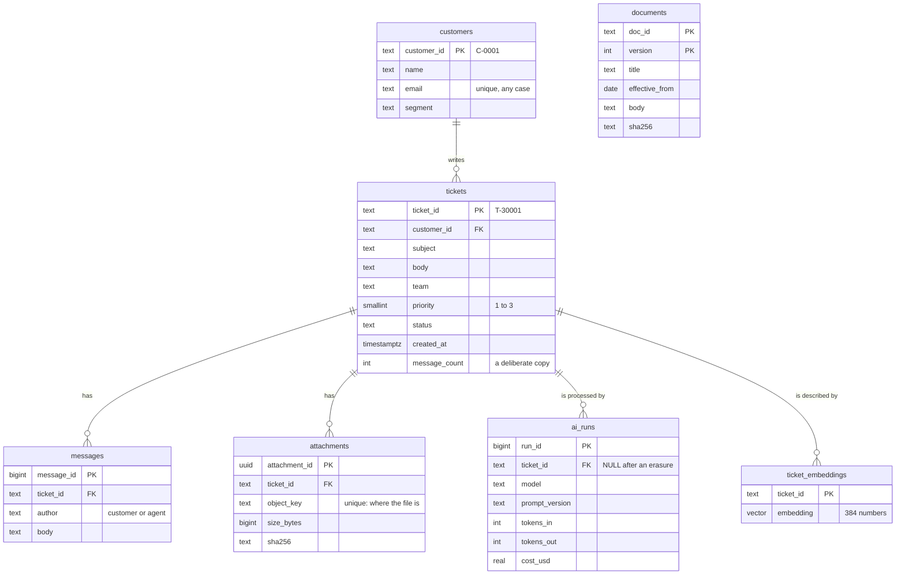

# The help desk's schema

The schema at the end of Module 2 (migrations 004 to 006). Later migrations change it: the cost
becomes `numeric` (007), files get an upload status (009), and vectors get a version (010).

One customer has zero or more tickets; one ticket has zero or more messages, attachments, AI
runs and vectors. Documents stand alone: the assistants read them, and no ticket owns them.

Identifiers are stable: a ticket keeps `T-30001` for its whole life, and no other ticket ever
gets that ID. Messages and AI runs get a number from the database.
