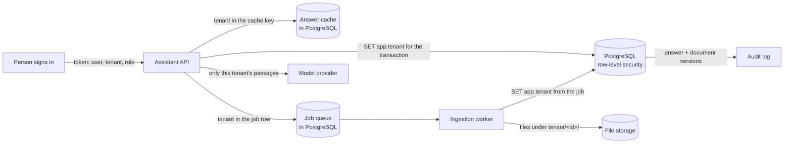

# Data and identity flow: where the tenant travels

Every request and every job carries the tenant. The database refuses a row of another tenant even when the code forgets a filter (row-level security, as in the authentication course).

| Data | Where | Tenant key | Version | Who may read it |
|---|---|---|---|---|
| Document file | File storage | folder `tenant/<id>/` | one file per version | the worker; staff of that tenant |
| Chunks and vectors | PostgreSQL | `tenant_id` + row-level security | `document_version` | the API for that tenant (public documents for customers) |
| Answer | PostgreSQL | `tenant_id` | the document versions it cited | staff and owner of that tenant |
| Cache entry | PostgreSQL | in the key | documents version in the key | the API for that tenant and audience |
| Job | PostgreSQL | `tenant_id` | the document version | the worker |

Measured: row-level security added about 0.1 ms to a request in the authentication course (4.3 ms off, 4.4 ms on).
