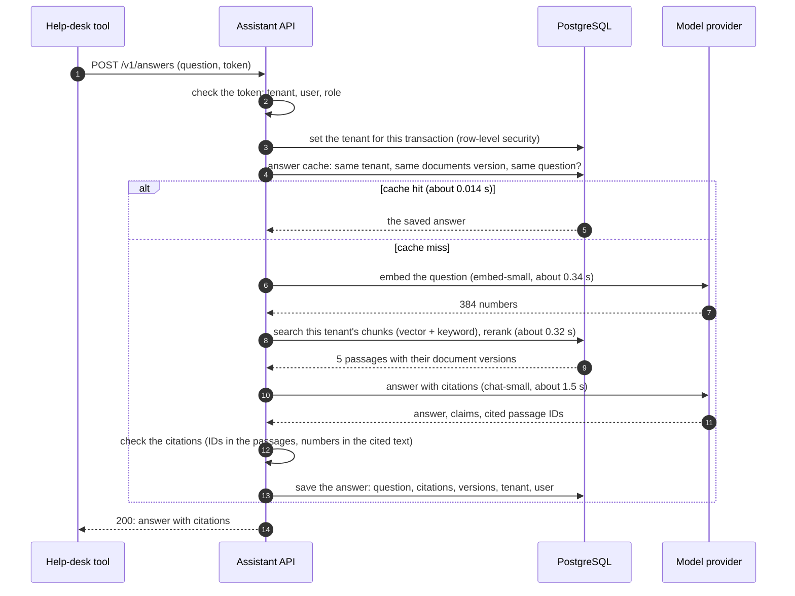

# Request flow: an agent asks a question

The primary flow (journey J1). Times are medians from the course team's runs (measured.toml); a real deployment adds network time.

What can go wrong at each step is in `../decisions/failure-modes.md`.
