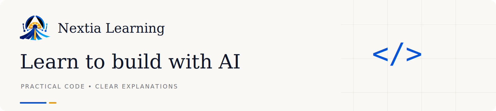

# Nextia Learning notebook branding

Based on the live Nextia Learning logo and theme. The existing logo is preserved.

## Included
- Header banners: light and dark, 1600 × 360.
- Transparent wordmarks: light and dark, 800 × 140. The dark wordmark is intended for dark backgrounds.
- Footer strips: light and dark, 1600 × 112.
- Section dividers: light and dark, 1600 × 20.
- Original transparent Nextia mark, SVG and PNG.
- A starter Python notebook with embedded header/footer attachments.

Every graphic comes as an editable SVG and a PNG. PNG is recommended for notebook compatibility. The SVGs use Georgia for headings and system sans-serif for supporting text; these are portable alternatives to the site's Newsreader and Inter. Font rendering may vary when editing SVGs.

## How to use
Duplicate `nextia-notebook-template.ipynb` for each lesson and edit its title, objectives, explanations, and examples. Its banners are embedded as attachments, so the notebook can be shared on its own. These attachments are standard Jupyter Markdown; verify display in your chosen viewer, particularly when using Colab or exported formats.

For notebooks stored alongside the assets folder, use this in a Markdown cell:

```markdown


# Your lesson title
```

Keep lesson titles as text below the banner for accessibility and search. Use one header and one footer per notebook; keep the code area uncluttered. Add a text link to https://learning.nextia-ai.com/ below the banner or at the end. Do not add an assumed copyright or code license: choose the code license for your project separately.

## Theme colours
| Role | Light | Dark |
|---|---|---|
| Background | #FAF8F4 | #121418 |
| Heading | #10172A | #F4F2ED |
| Accent | #0054D8 | #7AA8FF |
| Muted text | #6B6C74 | #9B9BA3 |
| Rule | #E7E2D9 | #2C313A |

Gold #F09C00 is a small accent drawn from the existing mark.
